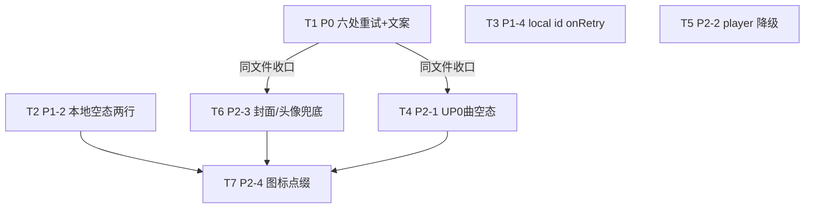

# BBPlayer 空态 / 降级 UI 增量架构设计 + 任务分解

- **架构师**：高见远（software-architect）
- **输入**：PM 许清楚《BBPlayer 空态/降级 UI 增量 PRD》+ 用户已拍板的 4 个范围决策
- **目标版本**：`@bbplayer/mobile` 2.6.2（React Native + Expo，apps/mobile）
- **性质**：纯 UI 收尾（免登录 412 修复 commit `d0aa1b77` 已真机验证后的后续）
- **硬约束**：① 严禁改动 `apps/mobile/src/lib/api/bilibili/`；② 不引入任何新依赖 / 框架；③ 保留 `PlaylistError` 与 `DataFetchingError` 组件定义不动，只改调用点；④ 本次不做登录引导按钮。

---

## 0. 范围与约束确认（回应用户 4 个拍板）

| 决策 | 落地方式 |
|------|----------|
| ① 仅修已渲染页面 | 云版 `CollectionList` / `FavoriteFolderList` / `MultiPageVideosList` 当前无路由 import，本次 0 改动；所有改动只落在已渲染页面。 |
| ② 公开可看 + 私有引导登录 | 本次无已渲染私有页受益，故**无"去登录"按钮**纳入。 |
| ③ 保留两个错误组件 | `PlaylistError` / `DataFetchingError` 定义文件**整文件不动**，仅在各调用点补 `onRetry` / 改 `text`。 |
| ④ P0 纯重试优先 | 登录按钮检测放 P1 后续（本次实际不做）。所有改动均为"补重试 + 文案升级 + 兜底"。 |

---

## 1. 实现方案 + 框架选型

- **技术栈**：沿用现有 RN + Expo + **React Native Paper**（MD3 组件/主题）、**`@expo/ui`**（material-symbols 图标 `Icon`）、**`sonner-native`**（toast）、**`expo-image`**（`useImage` / `Image`）、**`react-native-fast-squircle`** + **`expo-linear-gradient`** + **`runes2`**（被 `CoverWithPlaceHolder` 使用）。
- **架构模式**：页面级"查询 → 错误态 / 空态 / 正常态"三态分支（现有模式），**不引入新抽象层**。错误态统一委托 `PlaylistError` / `DataFetchingError` 渲染"文案 + 重试按钮"；空态复用 `ListEmptyComponent` 结构；破图兜底复用 `CoverWithPlaceHolder`。
- **核心改动本质**：全部是**调用点 props 调整**，零新组件、零新文件、零网络层触及。
- **为什么可行**：`PlaylistError` / `DataFetchingError` 已内置 `onRetry?: () => void`（传入即渲染"重试"按钮），`CoverWithPlaceHolder` 已内置"渐变 + 首字占位"，皆可直接复用。

---

## 2. 源码实读校验结论（关键：含对 PRD 的差异修正）

我逐文件实读了 PRD 标注的 `file:line`，结论如下。

### 2.1 通用组件 Props（已确认，两个定义字节级一致）

- `PlaylistError` 有**两份完全相同的实现**：
  - `apps/mobile/src/features/playlist/remote/components/PlaylistError.tsx`
  - `apps/mobile/src/features/playlist/local/components/PlaylistError.tsx`
  - 两处均：`interface PlaylistErrorProps { text?: string; onRetry?: () => void }`，默认 `text='加载失败'`，`onRetry` 存在时渲染 `<Button mode='contained'>重试</Button>`。
- `DataFetchingError`（`features/library/shared/DataFetchingError.tsx`）：与 `PlaylistError` 字节级一致，`{ text?: string; onRetry?: () => void }`。
- `CoverWithPlaceHolder`（`components/common/CoverWithPlaceHolder.tsx`）：props = `{ id: string|number; title: string; cover?: string|null|ImageRef; size: number; borderRadius?: number; style?: ViewStyle; cachePolicy?: ... }`。**它始终渲染"渐变 + 首字"占位，并把图片以 `expo-image` 淡入叠在其上**；它**没有 `onError` prop**。➡️ PRD 里写的"onError 回退渐变占位"实际应落地为"**用 `<CoverWithPlaceHolder>` 替换 `<Image>`/`<Avatar.Image>`**"，而非加 `onError` 回调。

### 2.2 六处 P0 错误态（均与 PRD 一致，`<PlaylistError text='加载失败' />`）

| 文件 | 行 | 当前 | import 的 PlaylistError | 作用域内 `refetch` |
|------|----|------|------------------------|--------------------|
| `app/playlist/remote/uploader/[mid].tsx` | 189–191 | `if (isUploadedVideosError \|\| isUserInfoError) return <PlaylistError text='加载失败' />` | remote | ✅ `refetch`（来自 `useInfiniteGetUserUploadedVideos`） |
| `app/playlist/remote/toview.tsx` | 167–169 | `if (isToViewDataError) return <PlaylistError text='加载失败' />` | remote | ✅ `refetch`（来自 `useGetToViewVideoList`） |
| `app/playlist/remote/search-result/global/[query].tsx` | 109–111 | `if (isErrorSearchData) return <PlaylistError text='加载失败' />` | remote | ✅ `refetch`（来自 `useSearchResults`） |
| `app/playlist/remote/search-result/fav/[query].tsx` | 103–105 | `if (isErrorSearchData) return <PlaylistError text='加载失败' />` | remote | ✅ `refetch`（来自 `useInfiniteSearchFavoriteItems`） |
| `app/playlist/recently/index.tsx` | 97–99 | `if (isError) return <PlaylistError text='加载失败' />` | **local** | ⚠️ **无**（见修正 1） |
| `app/playlist/remote/multipage/[bvid].tsx` | 234–236 | `if (isMultipageDataError \|\| isVideoDataError) return <PlaylistError text='加载失败' />` | remote | ✅ `refetch`（来自 `useGetMultiPageList`） |

好范式（已确认带 `onRetry`）：`favorite/[id].tsx:142`、 `collection/[id].tsx:148`、 `share/playlist.tsx:176` 均为 `<PlaylistError text='…具体文案…' onRetry={refetch} />`。

### 2.3 与 PRD 的 5 处差异修正（务必让工程师知悉）

- **修正 1 — `recently/index.tsx` 当前未解构 `refetch`**：它调用 `useMostPlayedTracks(14, 10)`（内部是 `@tanstack/react-query` 的 `useQuery`，**必定返回 `refetch`**），但调用点只解构了 `{ data, isPending, isError }`。➡️ T1 需补 `refetch` 解构，再 `onRetry={refetch}`。可行，无需改 hook。
- **修正 2 — `local/[id].tsx` 两处 query 均**未**解构 `refetch`**：`usePlaylistContentsInfinite(...)`（→ `isPlaylistDataError`）与 `usePlaylistMetadata(...)`（→ `isPlaylistMetadataError`）都是 React Query hook，返回 `refetch`，但调用点没解构。第 651 行合并分支 `isPlaylistDataError || isPlaylistMetadataError` 需要 `onRetry`。➡️ T3 需补两个 `refetch` 解构，并用组合 handler `onRetry={() => { refetchContents(); refetchMetadata() }}`（任一失败都重试两者，幂等安全）。
- **修正 3 — `CoverWithPlaceHolder` 无 `onError`**：PRD 的"onError 回退渐变占位"应实现为**替换** `<Image>`/`<Avatar.Image>` 为 `<CoverWithPlaceHolder>`。例外见修正 5。
- **修正 4 — P2-1（UP 0 曲）无需改 `RemoteTrackList` 签名**：`RemoteTrackList` 的 `TrackList` 把 `...flashListProps` 直接展开到 `<LegendList>`，即父组件传的 `ListEmptyComponent` 会自动透传。当前 `uploader/[mid].tsx:263` 的 `<TrackList>` **没传** `ListEmptyComponent`，故回落到组件内置默认"什么都没找到哦~"。➡️ P2-1 只需在 `uploader/[mid].tsx` 给 `<TrackList>` 传一个自定义 `ListEmptyComponent`（UP 0 曲文案），**不动 `RemoteTrackList.tsx`**。搜索页（search-result/global、fav）已有好范式（"换个关键词试试？"），假设其同样经 `ListEmptyComponent` 注入，本次不动。
- **修正 5 — `player.tsx` / `uploader/[mid].tsx` 的封面是 Skia `useImage` ref，非 `<Image>` 组件**：
  - `player.tsx:87`：`const coverRef = useImage(currentTrackCover ?? '', { onError: () => void 0 })` —— `coverRef` 是 Skia `Image` ref，被 `PlayerMainTab`（`imageRef={coverRef}`）和主题取色消费。**`CoverWithPlaceHolder` 是 expo-image 组件，不能直接替换 Skia ref**。➡️ P2-3 的 player 封面兜底应改为"封面 `currentTrackCover` 为空 / 加载失败时，在封面层后**叠加渐变占位背景**"（渐变色已由 `usePlaylistBackgroundColor` / `gradientMainColor` 计算，直接复用）。`onError` 当前是 no-op，保持即可。
  - `uploader/[mid].tsx:142`：`coverRef = useImage(resolveBilibiliImageUrl(uploaderUserInfo?.face) …)` 同理是 Skia ref（UP 头图）。➡️ 同 player 方案：加载失败叠加渐变占位，不替换为 `CoverWithPlaceHolder`。
  - 仅 **`SubscribedArtistList.tsx:34` 的头像**是普通 `<Avatar.Image source={{ uri }}>`（expo-image），可直接替换为 `<CoverWithPlaceHolder>`（见修正 3）。但注意 `Avatar.Image` 是**圆形**，`CoverWithPlaceHolder` 是 **squircle（圆角方）**，替换会改形状 —— 见 §9 待确认。

### 2.4 其他已确认现状

- `LocalPlaylistList.tsx:233–235`：单行的 `<Text style={styles.emptyList}>没有播放列表</Text>`（`LegendList` 的 `ListEmptyComponent`）。该文件已 `import { … useTheme } from 'react-native-paper'`，可用 `colors`。
- `local/[id].tsx:651–653`：已是两个分支：`isPlaylistDataError || isPlaylistMetadataError → '加载播放列表内容失败'` 与 `!playlistMetadata → '未找到播放列表元数据'`。与 P1-4 意图一致，只需给前者加 `onRetry`。
- `PlayerSideEffects.ts`：确为播放事件副作用（Bilibili -412/-101 等 toast 文案），**与本次 player UI 降级无关，严禁改动**（P2-2 只动 `player.tsx` 渲染分支）。

---

## 3. 文件列表（仅改动文件，无新建）

| # | 文件（相对 `apps/mobile/src`） | 涉及批次 |
|---|-------------------------------|----------|
| 1 | `app/playlist/remote/uploader/[mid].tsx` | P0(T1) + P2-1(T4) + P2-3(T6) |
| 2 | `app/playlist/remote/toview.tsx` | P0(T1) |
| 3 | `app/playlist/remote/search-result/global/[query].tsx` | P0(T1) |
| 4 | `app/playlist/remote/search-result/fav/[query].tsx` | P0(T1) |
| 5 | `app/playlist/recently/index.tsx` | P0(T1) |
| 6 | `app/playlist/remote/multipage/[bvid].tsx` | P0(T1) |
| 7 | `features/library/local/LocalPlaylistList.tsx` | P1-2(T2) |
| 8 | `app/playlist/local/[id].tsx` | P1-4(T3) |
| 9 | `app/player.tsx` | P2-2(T5) + P2-3 封面(T6) |
| 10 | `features/library/subscribed/SubscribedArtistList.tsx` | P2-3 头像(T6) |

> 注：① `uploader/[mid].tsx` 是"枢纽文件"，被 T1/T4/T6 三处改动，工程师在该文件内一次性完成三处 props 调整即可。② `PlaylistError` / `DataFetchingError` / `CoverWithPlaceHolder` 三个组件**定义文件不在本表**（保持不动）。③ 无新文件、无配置改动。

---

## 4. 组件 Props / 数据接口

### 4.1 既有组件（不改动，仅查看签名）

```ts
// features/playlist/remote/components/PlaylistError.tsx
// features/playlist/local/components/PlaylistError.tsx  (两份一致)
interface PlaylistErrorProps {
  text?: string          // 默认 '加载失败'
  onRetry?: () => void   // 传入即渲染「重试」按钮
}

// features/library/shared/DataFetchingError.tsx  (同上)
interface DataFetchingErrorProps {
  text?: string
  onRetry?: () => void
}

// components/common/CoverWithPlaceHolder.tsx
interface CoverWithPlaceHolderProps {
  id: string | number
  title: string
  cover?: string | null | ImageRef
  size: number
  borderRadius?: number
  style?: StyleProp<ViewStyle>
  cachePolicy?: 'none' | 'memory' | 'disk' | 'memory-disk' | null | undefined
}
```

### 4.2 调用点 Props 约定（设计产出，供工程师套用）

| 场景 | 调用写法 |
|------|----------|
| P0 六处错误态（可重试） | `<PlaylistError text='内容没加载出来，检查一下网络？' onRetry={refetch} />` |
| P0 `recently`（修正 1） | 先 `const { data: tracksData, isPending, isError, refetch } = useMostPlayedTracks(14,10)`，再 `onRetry={refetch}` |
| P1-4 `local/[id]` 可重试分支（修正 2） | `const { …, refetch: refetchContents } = usePlaylistContentsInfinite(...)`；`const { …, refetch: refetchMetadata } = usePlaylistMetadata(...)`；`<PlaylistError text='加载播放列表内容失败' onRetry={() => { refetchContents(); refetchMetadata() }} />` |
| P1-4 `local/[id]` 不可重试分支 | `<PlaylistError text='未找到播放列表元数据' />`（保持，无 `onRetry`） |
| P1-2 `LocalPlaylistList` 空态（两行） | 见 §8 共享结构，替换原单行 `<Text>` |
| P2-1 `uploader` UP 0 曲 | `<TrackList … ListEmptyComponent={<View style={emptyContainer}><Text variant='titleMedium'>这位 UP 主还没有发布音频作品</Text><Text variant='bodyMedium' style={{color:colors.onSurfaceVariant}}>换个 UP 主看看吧</Text></View>} />` |
| P2-3 头像（SubscribedArtistList） | 用 `<CoverWithPlaceHolder id={item.id} title={item.name} cover={item.avatarUrl} size={48} borderRadius={24} />` 替换 `<Avatar.Image size={48} source={…} />`（形状变更见 §9） |
| P2-3 封面（player / uploader 头图） | Skia `useImage` ref 不适用 `CoverWithPlaceHolder`；改为：封面源为空或失败时叠加渐变占位背景（复用已有渐变色） |

### 4.3 Mermaid 类图（组件与调用关系）

见 `class-diagram.mermaid`。

---

## 5. 程序调用流程（Mermaid 时序图）

见 `sequence-diagram.mermaid`。覆盖：① 查询失败 → 渲染错误态 → 用户点重试 → `refetch` 重请求；② 查询成功但空数据 → 渲染 `ListEmptyComponent`（含 P2-1 UP 0 曲分支）。

---

## 6. 任务列表（有序、含依赖、按 P0→P1→P2）

> 说明：下表按用户拍板的 P0/P1/P2 批次拆为 T1–T7。若主理人希望严格 ≤5 个任务，可把 T4–T7 合并为一个「P2 视觉与兜底」任务（T4–T7 之间无硬依赖，可合并实施）。每个任务均 ≥3 文件的最小粒度要求对"枢纽文件"多批次复用成立。

### T1 — [P0] 远程页错误态补重试 + 文案统一（6 文件）
- **源文件**：上表 #1–#6（六处）
- **具体改动**：把 6 处 `<PlaylistError text='加载失败' />` 改为 `text='内容没加载出来，检查一下网络？'` 且补 `onRetry={refetch}`。其中：
  - `uploader/[mid]`、`toview`、`search-result/global`、`search-result/fav`、`multipage` 五处 `refetch` 已在作用域，直接传。
  - `recently/index.tsx` 按**修正 1**补 `refetch` 解构后传入（组件 import 用 local 版 `PlaylistError`，无需改 import）。
- **依赖前置**：无（共享组件已支持 `onRetry`）。
- **优先级**：P0 ｜ **预估改动量**：极小（每处 1–2 行，约 6×1 行 + recently 解构 1 行）。

### T2 — [P1-2] `LocalPlaylistList` 空态两行升级
- **源文件**：上表 #7
- **具体改动**：将 `ListEmptyComponent` 内单行 `<Text>没有播放列表</Text>` 替换为两行结构（标题"还没有播放列表"+ 副文引导，见 §8），复用 `colors.onSurfaceVariant`；补 `emptyContainer`/`emptyText` style（参照 `SubscribedArtistList.tsx` 的 `emptyContainer`/`emptyText` 写法）。
- **依赖前置**：无（仅依赖 §8 共享结构约定）。
- **优先级**：P1 ｜ **预估改动量**：小（~10 行，含 style）。

### T3 — [P1-4] `local/[id].tsx` 文案规范 + onRetry
- **源文件**：上表 #8
- **具体改动**：按**修正 2**补 `usePlaylistContentsInfinite` 与 `usePlaylistMetadata` 的 `refetch` 解构；给 651 行可重试分支加 `onRetry={() => { refetchContents(); refetchMetadata() }}`（文案保持 '加载播放列表内容失败'）；653 行 '未找到播放列表元数据' 分支保持无 `onRetry`。
- **依赖前置**：无。
- **优先级**：P1 ｜ **预估改动量**：小（解构 + 1 行 onRetry）。

### T4 — [P2-1] UP 0 曲空态（uploader 页）
- **源文件**：上表 #1（`uploader/[mid].tsx` 的 `<TrackList>` 调用点，约 263 行）
- **具体改动**：按**修正 4**，向 `<TrackList>` 传自定义 `ListEmptyComponent`（"这位 UP 主还没有发布音频作品"+ 副文），仅在 `tracks.length===0 && !isPending && !isError` 时生效；不改 `RemoteTrackList` 默认文案。
- **依赖前置**：无硬依赖（建议与 T1 同文件顺手做）。
- **优先级**：P2 ｜ **预估改动量**：小（1 个 `ListEmptyComponent` 节点 + 条件判断）。

### T5 — [P2-2] `player.tsx` 播放器降级兜底
- **源文件**：上表 #9（`PlayerPage` 渲染分支）
- **具体改动**：当 `currentTrack` 为空（无正在播放）或播放失败时，渲染明确提示态（如"暂无正在播放的音频 / 播放出错了"），背景沿用已有渐变。仅动 `player.tsx` 的 JSX 分支与少量状态判断；**严禁触碰 `PlayerSideEffects.ts`**。
- **依赖前置**：无。
- **优先级**：P2 ｜ **预估改动量**：中（需定位 player 渲染主分支并加 guard）。

### T6 — [P2-3] 封面 / 头像破图兜底
- **源文件**：上表 #9（player 封面）、#1（`uploader/[mid]` 头图）、#10（SubscribedArtistList 头像）
- **具体改动**：
  - 头像（#10）：`<Avatar.Image>` → `<CoverWithPlaceHolder id title cover size borderRadius />`（形状变更见 §9）。
  - 封面（#9 player、#1 uploader）：Skia `useImage` ref 不适用 `CoverWithPlaceHolder`，改为封面源为空/失败时叠加渐变占位背景（复用既有渐变色）。`onError: () => void 0` 保持。
- **依赖前置**：无（但 #1 已被 T1/T4 改动，建议同文件收口）。
- **优先级**：P2 ｜ **预估改动量**：中（3 文件，封面走叠加渐变而非替换，需确认渐变色读取方式）。

### T7 — [P2-4] 空态图标点缀
- **源文件**：#7（LocalPlaylistList 空态）、#10（SubscribedArtistList 空态）、可顺带 T5 player 空态
- **具体改动**：在空态两行结构上方加一个 material-design 图标（`@expo/ui` 的 `Icon` 或 react-native-paper `IconButton`），如 `Icon` material-symbols `music-off` / `inbox` / `search-off`；**不引新依赖**。
- **依赖前置**：T2（空态结构）、T6（头像结构）完成后加图标最顺。
- **优先级**：P2 ｜ **预估改动量**：小。

### 6.1 任务依赖图（Mermaid）



> 所有任务彼此无**强编译依赖**（共享组件签名已就绪），依赖图主要表达"同文件收口"与"视觉层叠加顺序"的建议，工程师可按文件维度并行推进。

---

## 7. 依赖包清单（无新增）

全部已存在于 `apps/mobile/package.json`，本次 **0 新增**：

```
react-native-paper ^5.15.3        // Text / Avatar / useTheme / Appbar / IconButton
@expo/ui ~57.0.3                 // Icon (material-symbols)
sonner-native ^0.26.4            // toast（现有，非本次主用）
expo-image ~57.0.0               // useImage / Image（CoverWithPlaceHolder 内部）
react-native-fast-squircle ^1.1.5// CoverWithPlaceHolder 圆角容器
expo-linear-gradient ~57.0.0     // 封面/头像渐变占位
runes2 ^1.1.4                    // 首字截取（CoverWithPlaceHolder 内部）
@tanstack/react-query ^5.101.2   // refetch 来源（各页 query hook）
@shopify/react-native-skia 2.6.9 // player / uploader 封面 ref
@react-native-vector-icons/material-design-icons ^13.1.2 // 备用图标
```

---

## 8. 共享知识（跨文件约定，工程师务必统一遵守）

1. **统一可重试错误文案**：P0 六处统一为 `"内容没加载出来，检查一下网络？"`（参照好范式，但与 favorite/collection/share 的"具体失败文案"略有差异，本次按用户拍板统一为这句）。
2. **`onRetry` 统一写法**：`onRetry={refetch}`；若错误由多个 query 合并判断（如 `local/[id]` 的 data+metadata），用 `onRetry={() => { refetchA(); refetchB() }}`。
3. **空态两行结构（规范）**：
   ```
   <View style={styles.emptyContainer}>   // alignItems:center, justifyContent:center, paddingTop:80, gap:8
     <Text variant='titleMedium' style={styles.emptyText}>标题</Text>
     <Text variant='bodyMedium' style={{ color: colors.onSurfaceVariant }}>副文引导</Text>
   </View>
   ```
   颜色一律走 `useTheme().colors.onSurfaceVariant`（副文）与 `colors.background`（背景），不硬编码。
4. **封面 / 头像兜底模式**：
   - 普通 `<Image>` / `<Avatar.Image>`（expo-image）→ 直接替换为 `<CoverWithPlaceHolder id title cover size />`（始终渐变+首字占位，图片淡入其上）。
   - Skia `useImage` ref（player / uploader 头图）→ **不替换**，改为"源为空/失败时叠加渐变占位背景"，复用既有 `usePlaylistBackgroundColor`/`gradientMainColor`。
   - 不要为 `CoverWithPlaceHolder` 找 `onError`（它没有该 prop）。
5. **图标**：空态图标复用 `@expo/ui` 的 `Icon`（material-symbols）或 react-native-paper `IconButton`，**禁止引入新图标库**。
6. **红线（严禁）**：不改 `apps/mobile/src/lib/api/bilibili/`；不改 `PlaylistError`/`DataFetchingError`/`CoverWithPlaceHolder` 定义；不新增依赖；不添加"去登录"按钮。

---

## 9. 待明确事项 / 假设

1. **`recently` 与 `local/[id]` 的 `refetch` 解构**（修正 1、2）：已确认对应 hook 均返回 `refetch`，补解构即可，低风险。
2. **`SubscribedArtistList` 头像替换形状**：`Avatar.Image` 是圆形，`CoverWithPlaceHolder` 是 squircle（圆角方）。替换为 `CoverWithPlaceHolder` 会改变头像形状。需主理人/UI 确认是否接受；若不接受，则改为"圆形 `Avatar` + `onError` 隐藏并保留昵称首字"的兜底方案。
3. **P2-3 封面叠加渐变的具体取色**：player / uploader 的封面占位背景应复用哪个渐变对象（`usePlaylistBackgroundColor` 结果 vs `gradientMainColor`），需工程师在改时确认二者在该页面均已计算，避免引入新的取色逻辑。
4. **P2-1 默认文案走向**：`RemoteTrackList` 内置默认"什么都没找到哦~"是否要保留为搜索/其它场景兜底？本次仅 uploader 覆盖，默认不动；若后续其它页也要分场景，再统一。
5. **P2-4 图标 symbol 选择**：`music-off` / `inbox` / `search-off` 等具体符号待 UI 走查确认，不影响架构。
6. **搜索页空态假设**：假定 `search-result/global`、`fav` 已通过 `ListEmptyComponent` 注入"换个关键词试试？"（与 P2-1 机制一致），本次不动；如实际并非经 `ListEmptyComponent` 注入，则 P2-1 的透传方案不受影响（仅 uploader 改动），但需另查搜索页空态实现。
7. **真机/模拟器验证范围**：P0 改动建议真机验证"点重试能恢复"；P2 视觉项建议走查截图。

---

## 附：Mermaid 图件
- 时序图：`docs/sequence-diagram.mermaid`
- 类图：`docs/class-diagram.mermaid`
